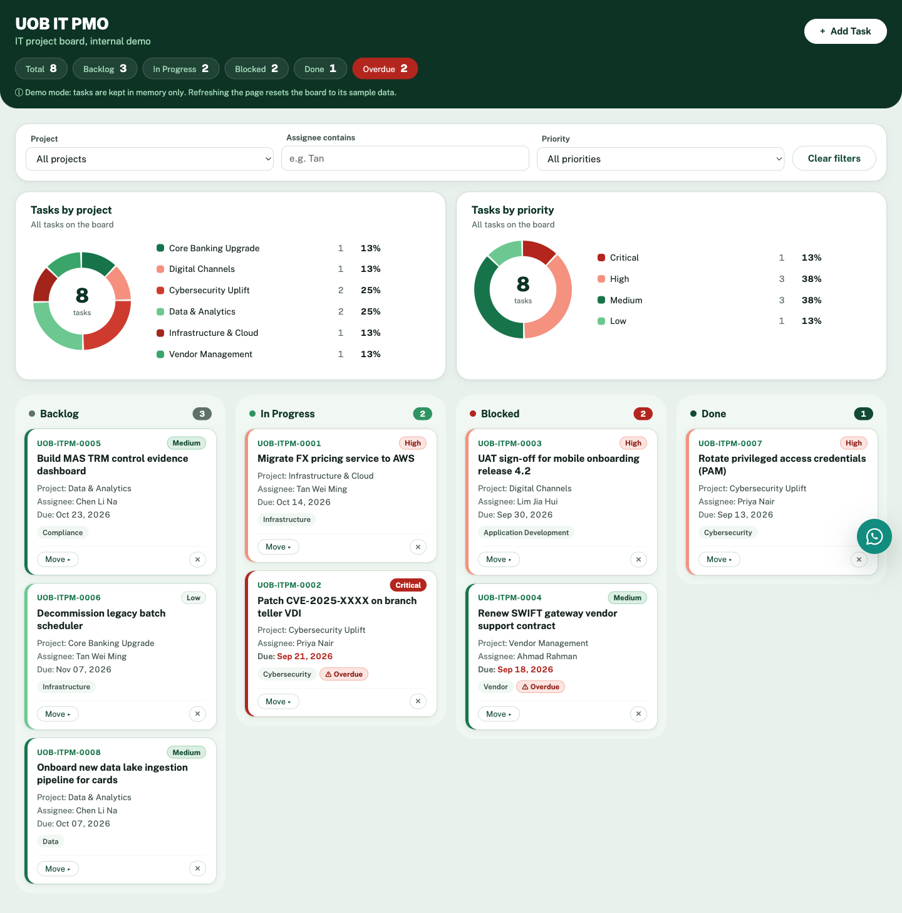

# UOB IT PMO — Project Board (Demo)

A single-page Kanban board for tracking IT project tasks across four columns: Backlog, In Progress, Blocked and Done. It is plain HTML, CSS and JavaScript in one file, with no build step or dependencies. Tasks are held in memory only, so reloading the page resets the board to its sample data.

**Live demo:** <https://vipulkuruppu.github.io/kanban4-V3/>



## Features

- **Four-column board.** Move cards by drag and drop, or with the keyboard using each card's **Move ▸** menu.
- **Add tasks** in a modal form with title, description, project/workstream, category, assignee, priority, due date and status.
- **Validation.** Required fields, length limits, whitelisted dropdown values and no due dates in the past. Errors are shown next to each field.
- **Filters** by project, assignee (text match) and priority. Column counts show how many tasks are visible out of the total.
- **Summary bar** with total, per-status and overdue counts. Overdue cards are highlighted.
- **Donut charts** of tasks by project and by priority, above the board. Each chart applies the other filters and shows the selected project's or priority's share in its centre. Click a legend row to filter the board, and click it again to clear.
- **Green and red theme.** Green for the brand and on-track work, red for Critical, Blocked and Overdue. The chart colours are checked for colour-blind separation, and every slice is also labelled with its count and percentage.
- **Delete with confirmation** inline on each card.
- **Email notification.** Each new task is sent to a configured address through [FormSubmit](https://formsubmit.co). If sending fails, you see a warning and the board is unaffected.
- **Accessible.** ARIA labels, per-field error messages, a focus-trapped modal, Escape to close menus and dialogs, live-region toasts and keyboard-operable chart legends.
- **Welcome dialog.** After 10 seconds on the page, a dialog thanks the visitor and gives the IT support hotline (12345678). It appears once per page load and waits if the Add Task form is open. The delay is set by `WELCOME_DELAY_MS`.
- **WhatsApp IT support.** A floating button in the bottom-right corner opens a dialog of suggested IT support questions (locked account, VPN, email, software installs and more). Choosing one opens a WhatsApp chat with IT support (+65 1234 5678) in a new tab, with the question already typed. The number is `WHATSAPP_NUMBER` and the questions are `WHATSAPP_QUERIES`.
- **Visit tracking (self-hosted only).** When served by `tools/visit_server.py`, the page reports how long each visit lasted. The server logs the source IP, user agent and duration to `logs/visits.jsonl`, and `tools/visit_report.py` turns the log into an HTML report. Tracking is switched off on GitHub Pages and `file://`.
- **Content Security Policy.** A CSP meta tag only allows network requests to the site itself and FormSubmit, and fonts from Google Fonts. It also sets a no-referrer policy.

## Running locally

Open `index.html` in a browser, or serve the folder:

```sh
python3 -m http.server
# then visit http://localhost:8000
```

To try visit tracking, run `python3 tools/visit_server.py` instead. Visit logs and reports are gitignored because IP addresses are personal data.

## Configuration

The email recipient is set in one place, near the top of the `<script>` block in `index.html`:

```js
const FORMSUBMIT_ENDPOINT = "https://formsubmit.co/ajax/YOUR_EMAIL@example.com";
```

Replace `YOUR_EMAIL@example.com` with your address. The first submission to a new address sends FormSubmit a one-time activation email. Confirm it and later submissions will be delivered.

> The endpoint is visible in the page source. To avoid publishing your address, use the random-string alias FormSubmit gives you after activation instead of the plain email.

## Deployment

The site is deployed to GitHub Pages by the workflow in [`.github/workflows/pages.yml`](.github/workflows/pages.yml) on every push to `main`, or manually from the Actions tab. Only `index.html` is published.

## Project structure

```text
index.html                    # the entire app: CSS, markup and JavaScript
docs/screenshot.png           # README screenshot
.github/workflows/pages.yml   # GitHub Pages deployment
tools/visit_server.py         # local server that also logs visits
tools/visit_report.py         # builds an HTML report from the visit log
security-reports/             # JSON reports from the security-scanner agent
CLAUDE.md                     # notes for Claude Code
.claude/commands/publish.md   # /publish command for Claude Code
.claude/agents/               # security-scanner and visit-monitor agents
```
